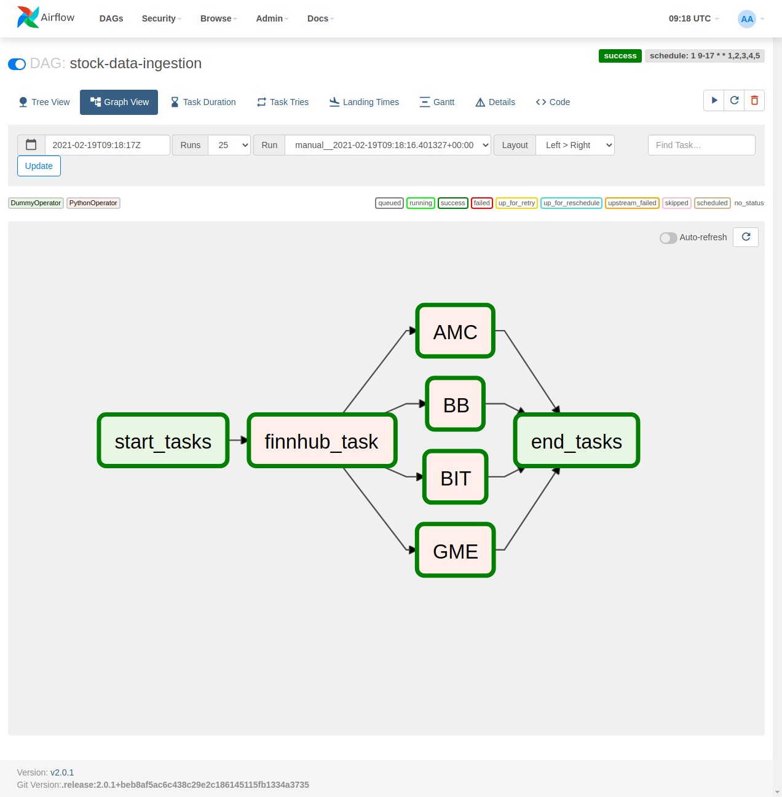

#  airflow-tendie

this is a part of the `deeptendies` project, where like minded put time together for tindies. 




- This airflow cluster is meant to capture data from APIs and save it for later consumption
- analytical and future tasks may be added down the roadmap
- this cluster is running airflow `v2.0.1`
- stonks! 


# Airflow Setup

http://airflow.apache.org/docs/apache-airflow/stable/start/docker.html

```
curl -LfO 'https://airflow.apache.org/docs/apache-airflow/2.0.1/docker-compose.yaml'
```

##### Init

```
mkdir -p ./dags ./logs ./plugins
echo -e "AIRFLOW_UID=$(id -u)\nAIRFLOW_GID=0" > .env
```

get images

```
mkdir ./dags ./logs ./plugins
echo -e "AIRFLOW_UID=$(id -u)\nAIRFLOW_GID=0" > .env
```

compose up

````
docker-compose up --build -d
docker-compose up -d
````

when done & ready to purge

```
docker-compose down --volumes
docker-compose down --volumes --rmi all
```


[ssh into airflow pod](https://phase2.github.io/devtools/common-tasks/ssh-into-a-container/)

```
docker exec -it airflow-tendie_airflow-webserver_1 /bin/bash
```

```
docker exec -it airflow-tendie_airflow-webserver_1 pip install -r requirements.txt
docker exec -it airflow-tendie_airflow-worker_1 pip install -r requirements.txt
```

[deletes everything](https://stackoverflow.com/questions/44785585/docker-how-to-delete-all-local-docker-images)

```
docker system prune -a --volumes
```


restart webserver
```shell
docker restart airflow-tendie_airflow-webserver_1
```